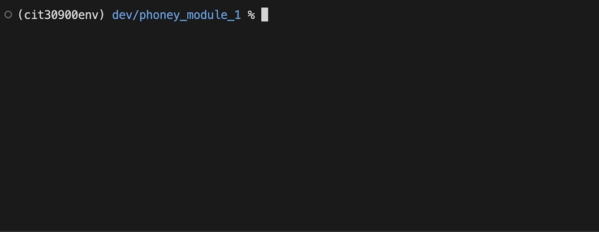

# Phoney Python Module, v.1
Using Python, create a Python module named `phoney` for cleaning and searching a list of telephone numbers.

In North America, phone numbers consist of three parts: XXX-YYY-ZZZZ where:

* XXX: the area code
* YYY: the exchange
* ZZZZ: the station code/line of the individual

## Requirements
1. You must use at least one *list comprehension* in your `phoney` module (you may use more than one)
2. Your `phoney` module should include the type/code hinting that specifies the expected data type for your function arguments.
3. Each function in your `phoney` module must also include a docstring that provides a brief overview of its functionality.

## Starter Code
Starter code is provided to you in `index.py` and `phoney.py`.

A sample CSV file with 10 phone numbers is included in `phone_numbers_sample.csv`. **YOU MUST DOWNLOAD AND USE A COMPLETE `phone_numbers.csv` FILE USING INSTRUCTIONS IN THE ASSIGNMENT.**

## Getting Started
1. Create a new directory named `phoney_module_v1` *inside* your **local root folder** for this course.
2. Write your code in the `phoney.py` and `index.py` files inside the `phoney_module_v1` directory.
3. You should be able to run your program by typing `python index.py` from the command line while you are in you `phoney_module_v1` directory.

## Instructions

### Functions in the `phoney` Module:
1. `clean_phone_numbers`: Accepts a list of phone numbers and returns a list of phone numbers that contain precisely 10 digits. It removes any special characters from the numbers (parenthesis, hypens) and removes any number that is not precisely 10 characters long
2. `find_number`: Accepts a list of "clean" phone numbers and a search term. Searches the entire list for an exact match of the search term. Returns a string that reports the number of times the search term is found in the list.
3. `find_areacode`: Accepts a list of "clean" phone numbers and a search term. Searches the **first three digits** of each element in the list for an exact match of the search term. Returns a string that reports the number of times the search term is found in the list.
4. `find_exchange`: Accepts a list of "clean" phone numbers and a search term. Searches the **digits at indices 3-5** of each element in the list for an exact match of the search term. Returns a string that reports the number of times the search term is found in the list.

### Instructions for the `index.py`
1. Create a function named `present_menu()` that presents a menu of options to the user and continues to request input until valid input is found. The function then returns the selection. Menu options should include:
  * F: Search for full phone number
  * A: Search for area code
  * E: Search for exchange
  * X: Exit the program

2. In the `main()` function:
  * Import the `phone_numbers.csv` file and read the contents into a 1-dimensional list
  * Pass the list of phone numbers to `phoney.clean_phone_numbers` to obtain a list of "clean" phone numbers
  * Report the results of the cleaning function to the user
  * Start a loop
    * Ask the user for a menu selection by calling `present_menu()`
    * If the user enters `X`, quit the program
    * If the user chooses another option, ask the user to input a search term
      * Invoke the appropriate function in the `phoney` module and pass it the list of clean phone numbers and the user's search term
      * Report the results of the search function
    * Restart the loop (ask the user for a new menu selection)

## Hints
* Although we think of phone numbers as "numbers", your program will work much more smoothly if you treat them as **strings** that contain digits (not "numbers")

## Submission Instructions
To submit, zip the following files and attach them to Canvas:
1. `phoney.py`
2. `index.py`
3. `phone_numbers.csv` (NOT the sample CSV distributed here)

## Example
An animated .gif file with a working solution appears below.

